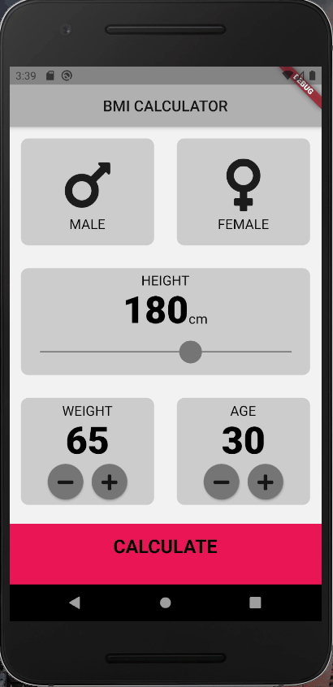

# BMI Calculator 

## Objective 

In this project a flutter app that calculates your body mass index (BMI) was created. The project is part of the flutter course offered by Dr. Anegla Wu. Starting files can be found [here](https://github.com/londonappbrewery/bmi-calculator-flutter).
## Results

Look at the demonstrator below to get an idea of the app.
1. Select gender 
2. Select height 
3. Select weight 
4. Select age
5. Calculate results

